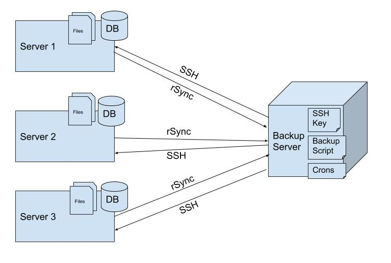

# 🗄️ backup.sh
Backup MySQL &amp; MongoDB | Bash Shell Script | Email Reports

<p align="center">
    
</p>

## Terminology Used


## Prerequisites
- SSH Key Access to Remote Server. [How to setup?](#setup-ssh-key)
- [Sendgrid](https://signup.sendgrid.com/) Account (Optional) -- Incase if you want to turn on reports emailing.

# Setup Instructions
<div id="setup-ssh-key"/>

### Setting up SSH Key
Make sure to follow the below steps while creating SSH Keys and using them.
Login with username specified in Github Secrets. Generate a RSA Key-Pair:

 ```bash
 ssh-keygen -t rsa -b 4096 -C "your_email@example.com"
 ```

Add newly generated key into Authorized keys.

```bash
cd .ssh && touch authorized_keys && chmod 600 authorized_keys
cat ~/.ssh/id_rsa.pub >> ~/.ssh/authorized_keys
```

`Copy` the Private Key file content and save it or `download` the Private Key file

```bash
clip < ~/.ssh/id_rsa
```

### Test a Connection by supplying downloaded private key
```
ssh -i ~/.ssh/id_rsa user@newserver
```

### Update the `PKEY` variable in backup.sh for private key location
```bash
PKEY=id_rsa
to
PKEY=/location_of_your_privatekey
```

### Create a conf file using `.example.conf` & Fill up the conf file.
Note: Filename should start with `.` && the positions of variable should stay same refer `backup.sh` file

```bash
mv .example.conf .prod_server.conf
```

### Update the `SENDGRID_API_KEY` if you want to turn on backup reports emailing. (Optional)
```
SENDGRID_API_KEY=""
to
SENDGRID_API_KEY="your-sendgrid-api-key"
```

### Test a Backup Script
```bash
sh backup.sh
```
If all goes well, set it up on cron.

### Set it up on Cron
```
0 0 * * * cd /to/location/of/script && sh backup.sh | tee reports.txt # Every Night at Midnight
```
Cron will do remaining..

## Follow me at
<a href="https://github.com/dr5hn/"></a> <a href="https://twitter.com/dr5hn/"></a> <a href="https://www.linkedin.com/in/dr5hn/"></a>

## Contributions / Suggestions / Feedbacks
```
Contributions, Suggestions & Feedbacks are Most Welcome
Get in touch with me at gadadarshan[at]gmail[dot]com
```

That's all Folks !! Enjoy. 
